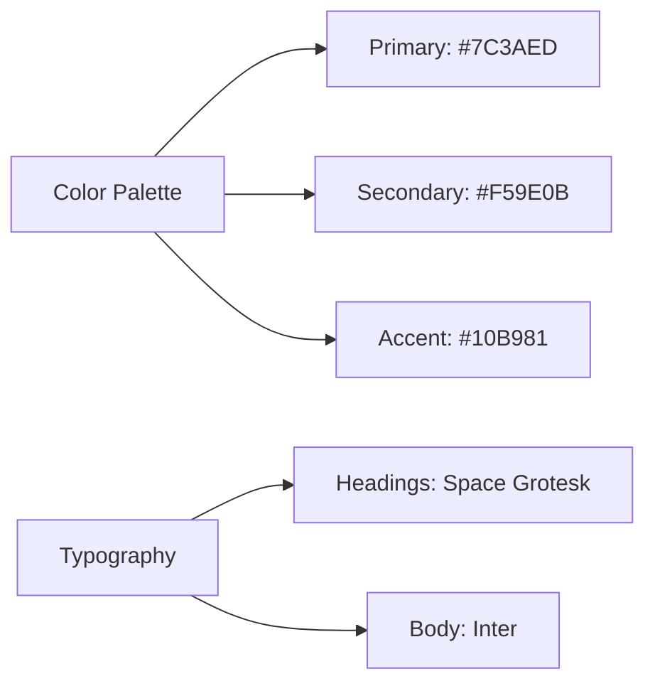

# Product Context

## User Experience Goals
1. **Portfolio Visitors**: 
   - Instant access to high-quality artwork previews
   - Intuitive category filtering (chibi/emotes/illustrations)
   - Clear commission process explanation

2. **Commission Clients**:
   - Transparent pricing tiers
   - Visual examples of package differences
   - Secure submission process

3. **Event Organizers**:
   - Professional convention history showcase
   - Downloadable media kits
   - Past event metrics

## Brand Guidelines

## Content Strategy
- **Artwork Metadata**: Captured in image-manifest.json
- **Commission Structure**: 
  - Base prices by complexity
  - Add-on pricing matrix
  - Turnaround time estimates
- **Convention Archive**:
  - Year-over-year participation
  - Featured artwork per event
  - Attendance statistics

## Success Metrics
| Metric | Target | Current |
|--------|--------|---------|
| Portfolio Page Load | <2s | 1.8s |
| Commission Form CTR | 15% | 12% |
| Convention ROI | 2:1 | 1.5:1 |

## Risk Management
- **Artwork Protection**: Watermarking system
- **Form Spam**: hCaptcha integration
- **Style Consistency**: Design token system
