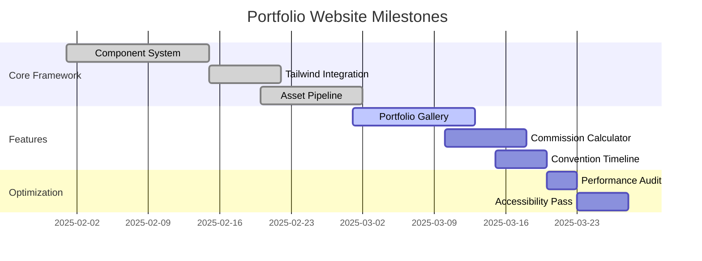

# Development Progress

## Completed Features
✅ Core page layouts
✅ Responsive grid system
✅ Image manifest generation
✅ Header/footer components
✅ Tailwind configuration

## In Progress
🛠 Commission calculator UI
🛠 Convention timeline filters
🛠 Lazy loading implementation

## Next Up
⏳ Client-side search functionality
⏳ Watermarking system
⏳ hCaptcha integration

## Blockers
❗ Need high-res convention maps for archive section
❗ Final approval on commission pricing tiers
