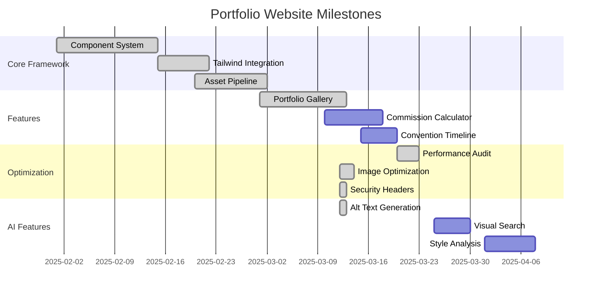

# Development Progress

## Completed Features
✅ Core page layouts
✅ Responsive grid system
✅ Image manifest generation
✅ Header/footer components
✅ Tailwind configuration
✅ Portfolio gallery with filtering
✅ Advanced image optimization (AVIF/WebP)
✅ Lazy loading implementation
✅ Security headers
✅ AI-powered alt text generation
✅ Clean URLs (removed .html extensions)

## In Progress
🛠 Commission calculator UI
🛠 Convention timeline filters
🛠 Build-time image optimization

## Next Up
⏳ Client-side search functionality
⏳ Watermarking system
⏳ hCaptcha integration
⏳ AI visual search
⏳ Color palette extraction

## Blockers
❗ Need high-res convention maps for archive section
❗ Final approval on commission pricing tiers
