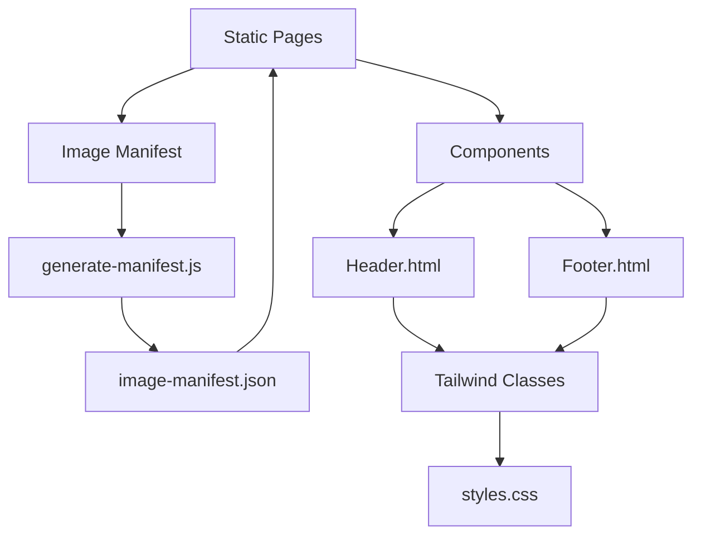

# System Architecture

## Key Architectural Components

### 1. Component-Based Templates
- **Header/Footer System**: Reusable HTML components stored in `/components`
- **Pattern**: Atomic design methodology for template organization
- **Integration**: Static HTML imports via JavaScript modules

### 2. Image Manifest System
- **Generator**: `scripts/generate-manifest.js` automates asset cataloging
- **Output**: `image-manifest.json` drives gallery constructions
- **Pattern**: Content-as-data approach for portfolio sections

### 3. Styling Stack

## Key Technical Decisions
1. **No Build System**: Pure HTML/CSS/JS for simplicity
2. **Tailwind JIT**: Enabled in `tailwind.config.js`
3. **Asset Versioning**: Query string cache busting in manifest
4. **Lazy Loading**: Intersection Observer API for images

## Design Patterns
- Atomic CSS utility class organization
- Mobile-first responsive breakpoints
- CSS custom properties for theming
- Static site generation pattern
- Convention-over-configuration for paths

## Future Considerations
- Commission calculator component
- Convention timeline visualization
- Client-side search implementation
