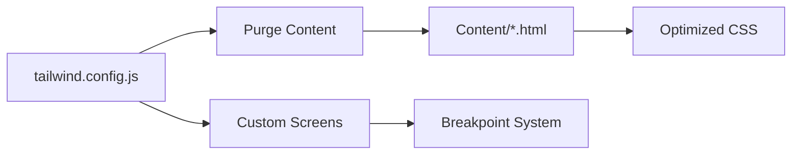

# Technical Context

## Core Dependencies
```json
{
  "dependencies": {
    "tailwindcss": "^3.3.0",
    "postcss": "^8.4.0",
    "autoprefixer": "^10.0.0"
  },
  "devDependencies": {
    "fast-glob": "^3.2.0"
  }
}
```

## Development Setup
1. **Build Process**: `npm run build` generates optimized CSS
2. **Image Manifest**: `node scripts/generate-manifest.js` updates asset catalog
3. **Live Server**: Built-in VSCode Live Server extension for testing

## Technical Constraints
- No JavaScript framework dependencies
- Maximum image dimension: 2000px (width/height)
- Gallery pages must load under 2s on 3G connections
- Strict CSP rules enforced in production

## Key Configurations


## Performance Budget
| Asset Type | Size Limit |
|------------|------------|
| CSS        | ≤50KB      |
| JavaScript | ≤100KB     |
| Images     | ≤500KB each|
